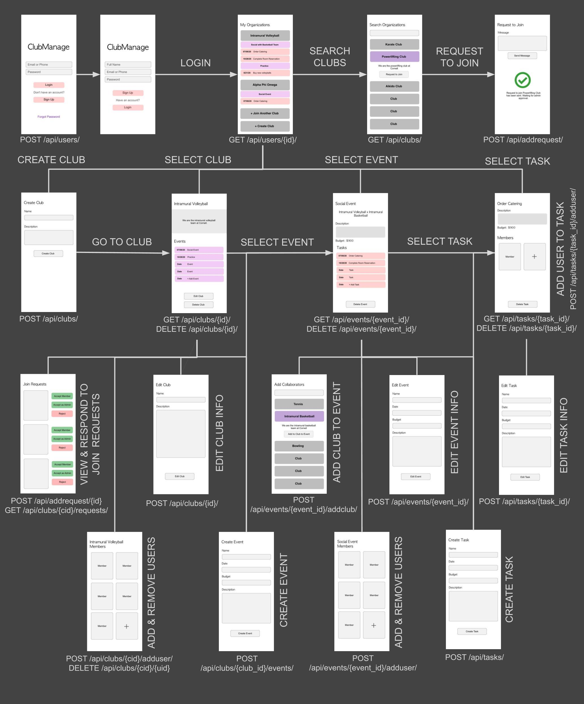

# ClubManage: Club Management App

ClubManage is a club management application built to help students organize their involvements in multiple organizations. Club admins and members can create events with other organizations and add associated tasks.

Application is deployed [here](http://35.243.182.211/) using Google Cloud Platform

API Specifications are located [here](https://app.swaggerhub.com/apis/ClubManage/ClubManage-Backend/1.0.3-oas3)

Expected functionality is shown in the wireframe flowchart below:

## Background
Having been on the board of several clubs, I noticed many inefficiencies in event planning and organization, particularly when events involved members of multiple organizations. While group chats and shared google drive folders can help facilitate collaboration between members, sifting through messages and folders can be cumbersome. This app hopes to address this problem by providing a centralized location for event documentation (i.e. which members/clubs are involved, budget, task-sign up, etc.), allowing for easy info access. The app also provides an easy way for a member to sign up for (or be assigned) events/tasks. On the student user side, accessing info is easy - through the homepage that displays all of the user's clubs and associated events/tasks.
